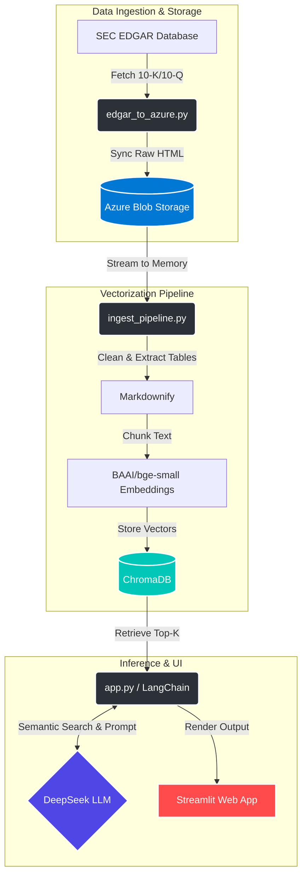
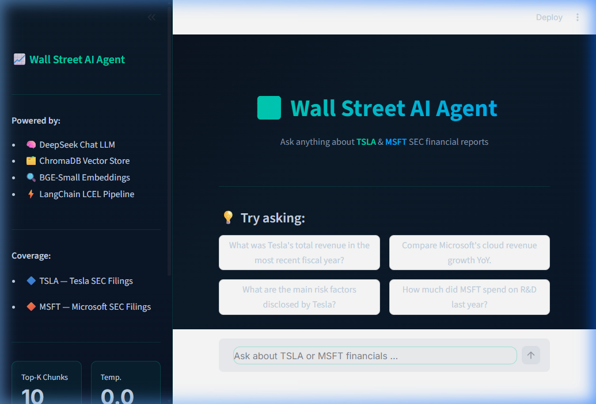

# 📈 Wall Street AI Agent

[](https://www.python.org/downloads/release/python-3120/)
[](https://streamlit.io/)
[](https://python.langchain.com/)
[](https://deepseek.com/)
[](https://opensource.org/licenses/MIT)

An enterprise-grade, cloud-native **Retrieval-Augmented Generation (RAG)** pipeline designed to ingest, process, and interactively query SEC financial reports (10-K, 10-Q) for companies like strictly **TSLA** and **MSFT** **e.g.**.

---

## 🚀 Overview

The **Wall Street AI Agent** is a full-stack AI system that bridges the gap between raw financial data from the SEC EDGAR database and an interactive LLM reasoning engine. It automates the extraction of dense financial tables and corporate text, structurally converts them to markdown, vectorizes the semantic chunks, and serves the data through an elegant, real-time chat interface powered by the deeply analytical **DeepSeek** model.

## 🏗️ System Architecture

The project employs a robust ETL (Extract, Transform, Load) and Query architecture. A key technical feature is the **iXBRL HTML-to-Markdown parsing strategy**, which uses `BeautifulSoup` and `Markdownify` to cleanly extract intricate financial tables from raw HTML, completely preserving the tabular structure before it enters the embedding model.



## 🛠️ Tech Stack

**Ingestion & Cloud Storage:**
* `sec-edgar-downloader` (Targeted scraping of core financial docs)
* `azure-storage-blob` (Cloud Data Lake holding raw HTML)

**Data Processing & Vectorization:**
* `BeautifulSoup4` + `Markdownify` (HTML parsing and structural preservation)
* `LangChain` (Document loaders and text splitters)
* `HuggingFaceEmbeddings` (`BAAI/bge-small-en-v1.5`)
* `ChromaDB` (Local Vector Database)

**Frontend & Inference Engine:**
* `Streamlit` (Interactive Web App with Resource Caching)
* `ChatOpenAI` wrapper targeting the **DeepSeek API** (`deepseek-chat`)

---

## ⚡ Quick Start

### 1. Prerequisites
Ensure you have Python 3.10+ installed. Clone this repository and navigate to the project root.

```bash
git clone https://github.com/Cloudpeng121/wall-street-ai-agent.git
cd wall-street-ai-agent
```

### 2. Environment Setup
Create a virtual environment (optional but recommended) and install dependencies:

```bash
python -m venv venv
venv\Scripts\activate  # Windows
# source venv/bin/activate  # Mac/Linux

pip install -r requirements.txt
```

### 3. Configuration
Copy the `.env.example` file to create your own local `.env` file containing your secret keys.

```bash
cp .env.example .env
```
Fill in the following variables:
* `DEEPSEEK_API_KEY`: Your model inference key.
* `AZURE_STORAGE_CONNECTION_STRING`: Your Azure Blob storage connection string (used during the ingestion phase).

### 4. Running the Pipeline

**Step A: Ingest Data to Azure (Optional)**
*Extracts documents from SEC EDGAR and uploads core HTML pages to Azure Blob Storage.*
```bash
python src/edgar_to_azure.py
```

**Step B: Build Vector Database (Optional)**
*Streams HTML docs from Azure, converts to markdown, chunks, and builds the local `chroma_db`.*
```bash
python src/ingest_pipeline.py
```

**Step C: Launch the Web Agent (Main Entrypoint)**
*Starts the interactive chat interface.*
```bash
python -m streamlit run app.py
```

---

## 📸 App Preview



The app features a chat-based UI and simulated streaming responses directly grounded in validated real-world SEC source documentation.

---

## 🌟 Key Features

### 1. iXBRL HTML-to-Markdown Parsing Strategy
Raw SEC financial reports are notoriously messy, filled with thousands of lines of inline styles, scripts, and fragmented XBRL tags. Instead of attempting to use standard PDF OCR or raw text dumps, this pipeline targets the **HTML `primary-document`**.
By using `BeautifulSoup` to strip the garbage layers and passing the clean DOM tree into `Markdownify`, financial data tables (like Income Statements and Balance Sheets) are flawlessly converted into Markdown tables (`|---|---|---|`). This allows the DeepSeek LLM to mathematically reason over structured rows and columns rather than hallucinating over scrambled raw text.

### 2. Streamlit Resource Caching
The application UI wraps the heavy `ChromaDB` loading phase, the BGE embedding initialization, and the LangChain pipeline assembly inside a `@st.cache_resource` decorator. The UI re-renders instantly upon user chat interaction without paying the model loading startup tax twice.

### 3. Advanced Inference (DeepSeek)
Utilizes the high-intelligence `deepseek-chat` model fed by a rigorously restricted system prompt, enforcing that the model relies *strictly* on semantic chunk context. If data is absent, the agent is forced to truthfully admit the lack of information over hallucinating financial figures.
